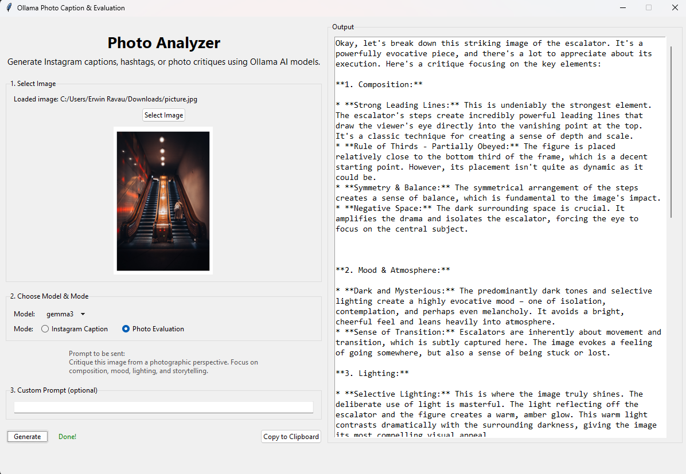

# Photo Analyzer

A desktop tool for generating Instagram captions, hashtags, and photographic evaluations for your images using local AI models via [Ollama](https://ollama.com/). Supports common image formats and Canon CR3 RAW files.

## Features

- Drag & drop or select images (JPG, PNG, CR3, etc.)
- Generate Instagram captions and hashtags
- Get photographic critiques (composition, mood, lighting, storytelling)
- Choose between different Ollama models (e.g., `llava`, `gemma3`)
- Image preview (requires Pillow)
- Clipboard copy of results (requires pyperclip)



---

## 1. Prerequisites

- **Python 3.8+**  
- **[Ollama](https://ollama.com/download) installed and running locally**  
- **Ollama models**: `llava` (for image understanding), optionally `gemma3` or others

---

## 2. Install Python Dependencies

Open a terminal in the project folder and run:

```sh
pip install -r requirements.txt
```

If you don't have a `requirements.txt`, install manually:

```sh
pip install requests pillow pyperclip rawpy imageio
```

- `rawpy` and `imageio` are only needed for CR3 RAW file support.
- `pillow` is needed for image preview.
- `pyperclip` is optional (for clipboard copy).

---

## 3. Set Up Ollama and Download Models

1. **Install Ollama**  
   Download and install from [https://ollama.com/download](https://ollama.com/download).

2. **Start Ollama**  
   Ollama should run automatically, or start it from your terminal:

   ```sh
   ollama serve
   ```

3. **Download models**  
   In a terminal, run:

   ```sh
   ollama pull llava
   ollama pull gemma3
   ```

   You can add more models as desired.

---

## 4. Run the Application

```sh
python photo-analyzer-gui.py
```

- The GUI will open. Drag & drop an image or use "Select Image".
- Choose your model and mode (caption or evaluation).
- Optionally enter a custom prompt.
- Click "Generate" to get results.

---

## 5. Troubleshooting

- **CR3 RAW support:**  
  If you get errors with CR3 files, ensure `rawpy` and `imageio` are installed.
- **Clipboard copy:**  
  If clipboard copying fails, install `pyperclip`:

  ```sh
  pip install pyperclip
  ```

- **Ollama connection errors:**  
  Make sure Ollama is running and models are downloaded.

---

## 6. File Overview

- `photo-analyzer-gui.py` — Main GUI application
- `photo-analyzer.py` — Command-line version (optional)
- `README.md` — This file

---

## 7. License

MIT License (see `LICENSE` file if present)

**Note:**  
This project uses third-party Python libraries (such as requests, Pillow, rawpy, imageio, pyperclip) which are distributed under their own respective licenses. Please refer to each library's documentation for license details.


